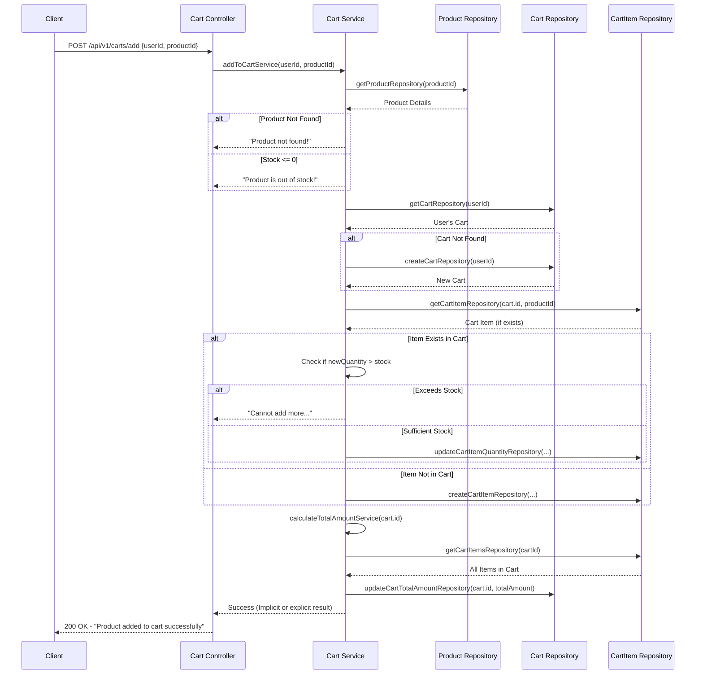
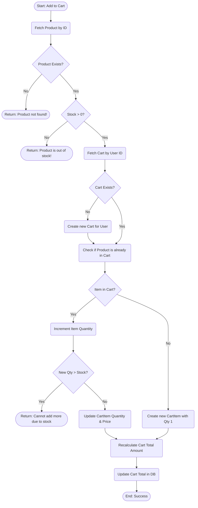

# Add to Cart Business Logic Flow

This document outlines the business logic, sequential flow, and decision-making process for the "Add to Cart" functionality in the Technotree E-commerce backend.

## 1. Overview of the Add to Cart Process

The "Add to Cart" operation takes a `userId` and a `productId` from the client request. Its primary goal is to safely add a product to the user's cart while ensuring:
- The product exists.
- The product has sufficient stock available.
- The user's cart is created if it does not yet exist.
- If the product already exists in the cart, its quantity is incremented safely.
- The overall cart total amount is recalculated and updated.

---

## 2. Sequence Diagram

This sequence diagram illustrates the step-by-step interactions between the Client, Controller, Service, and Repository layers.

---

## 3. Business Logic Flowchart

The flowchart below focuses strictly on the logical decision tree the `Cart Service` follows to process an "Add to Cart" request.

---

## 4. Detailed Component Breakdown

### Controller Level (`cart.controller.js`)
The `addToCartController` expects a `POST` body containing `userId` and `productId`. It acts as the HTTP interface, delegating the complex validation and database interactions entirely to the service layer. If the service is successful, it responds with a standard `200 OK` status.

### Service Level (`cart.service.js`)
The `addToCartService` is the heartbeat of this functionality.
1. **Product Validation**: Ensures the product exists and has a stock greater than `0`.
2. **Cart State Handling**: Checks if the user already has a pending cart. If they do not, it provisions a new `Cart` record via the repository.
3. **Upserting Cart Items**: 
   - Uses `getCartItemRepository` to see if the item is already present.
   - If present, it checks if incrementing the quantity by `1` would exceed the maximum available `stock` of the product. If it passes, it updates the record.
   - If not present, it inserts a new `CartItem` record with a quantity of `1` and locks in the current `product.price`.
4. **Recalculating Totals**: Invokes a helper service `calculateTotalAmountService` which retrieves all items for the specific cart, loops through them summing `(price * quantity)`, and finally updates the main `Cart` parent record with the `totalAmount`.

### Repository Level
The repositories simply abstract Sequelize database operations:
- **Product**: Finds product details and stock information.
- **Cart**: Finds a cart by user, creates a new cart, and updates the cart's overall total.
- **CartItem**: Finds a specific product in a cart, fetches all products in a cart, updates quantities, or creates new item linkages.
